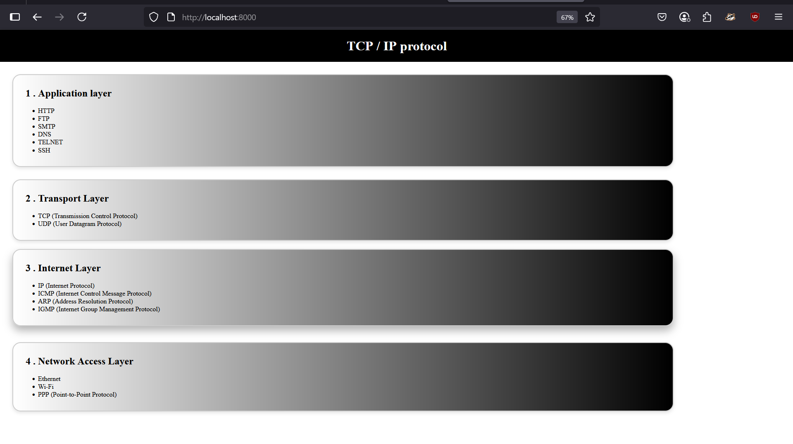

## Date:02/04/2025

## AIM:
To develop a simple webserver to serve html pages and display the list of protocols in TCP/IP Protocol Suite.

## DESIGN STEPS:
### Step 1: 
HTML content creation.

### Step 2:
Design of webserver workflow.

### Step 3:
Implementation using Python code.

### Step 4:
Import the necessary modules.

### Step 5:
Define a custom request handler.

### Step 6:
Start an HTTP server on a specific port.

### Step 7:
Run the Python script to serve web pages.

### Step 8:
Serve the HTML pages.

### Step 9:
Start the server script and check for errors.

### Step 10:
Open a browser and navigate to http://127.0.0.1:8000 (or the assigned port).

## PROGRAM:
```
<!DOCTYPE html>
<html lang="en">
<head>
    <meta charset="UTF-8">
    <meta name="viewport" content="width=device-width, initial-scale=1.0">
    <title>TCP/IP SIMPLE WEBSERVER</title>
    <style>
        *{
            margin: 0px;
            padding: 0px;
        }
        .Navbar h1{
            background-color: black;
            color: white;
            padding: 20px;
            text-align: center;
        }
        .c1{
            background: linear-gradient(to right, white, black);
            border-radius: 20px;
            border: 2px solid #ccc;
            width: 80%;
            margin: 30px;
            padding: 30px;
            box-shadow: 0 4px 8px rgba(0,0,0,0.1);
            transition: all 0.3s ease;
        }
        .UN{
            margin-left: 30px;
        }
        .c1:hover{
            transform: translateY(-10px);
            box-shadow: 0px 10px 20px rgba(0,0,0,0.3);
        }
    </style>
</head>
<body>
    <div class="Navbar">
        <h1>TCP / IP protocol</h1>
    </div>

    <div class="content">
        <div class="c1">
            <h2>1 . Application layer</h2>
            <br>
            <ul class="UN">
                <li>HTTP</li>
                <li>FTP</li>
                <li>SMTP</li>
                <li>DNS</li>
                <li>TELNET</li>
                <li>SSH</li>
            </ul>
        </div>
        <div class="c1">
            <h2>2 . Transport Layer</h2>
            <br>
            <ul class="UN">
                <li>TCP (Transmission Control Protocol)</li>
                <li>UDP (User Datagram Protocol)</li>
            </ul>
        </div>
        <div class="c1">
            <h2>3 . Internet Layer</h2>
            <br>
            <ul class="UN">
                <li>IP (Internet Protocol)</li>
                <li>ICMP (Internet Control Message Protocol)</li>
                <li>ARP (Address Resolution Protocol)</li>
                <li>IGMP (Internet Group Management Protocol)</li>
            </ul>
        </div>
        <div class="c1">
            <h2>4 . Network Access Layer</h2>
            <br>
            <ul class="UN">
                <li>Ethernet</li>
                <li>Wi-Fi</li>
                <li>PPP (Point-to-Point Protocol)</li>
            </ul>
        </div>
    </div>
</body>
</html>
```

## OUTPUT:



## RESULT:
The program for implementing simple webserver is executed successfully.
